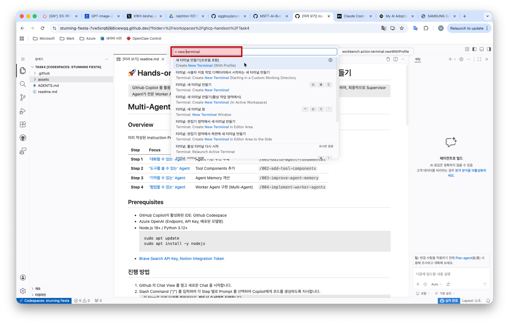
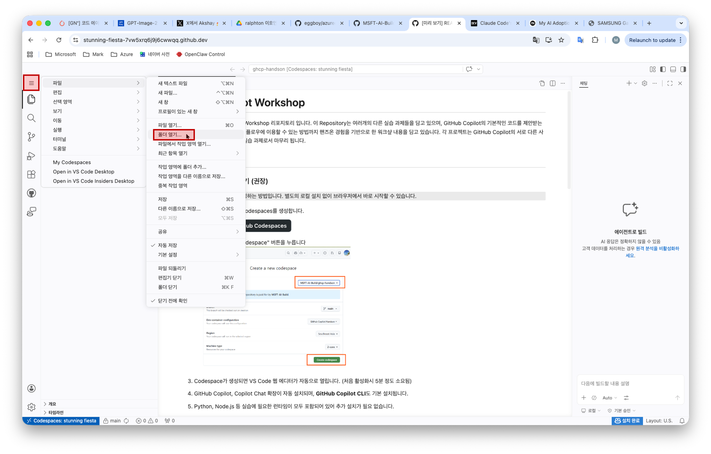
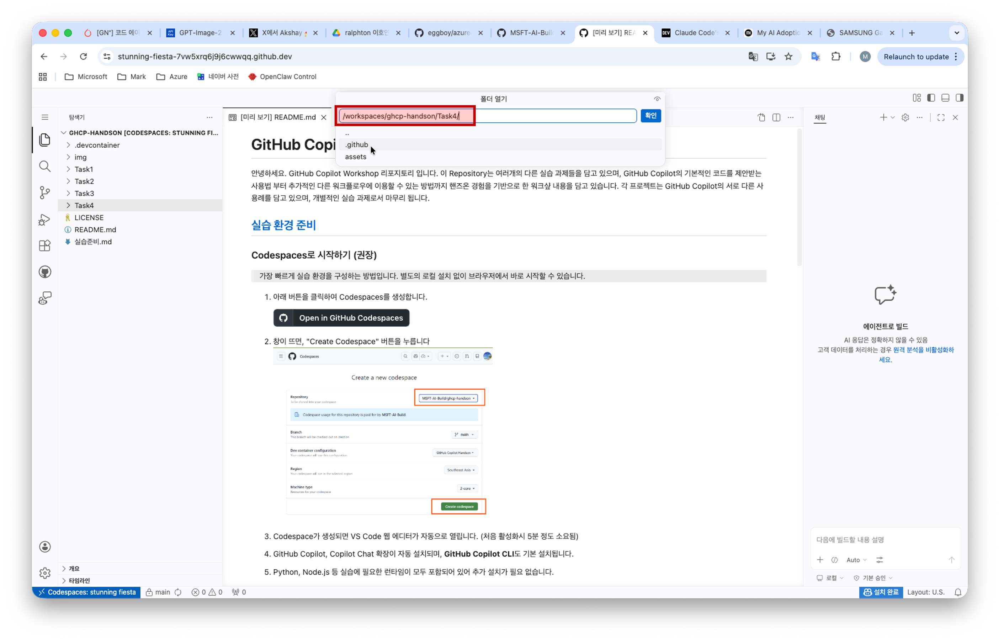
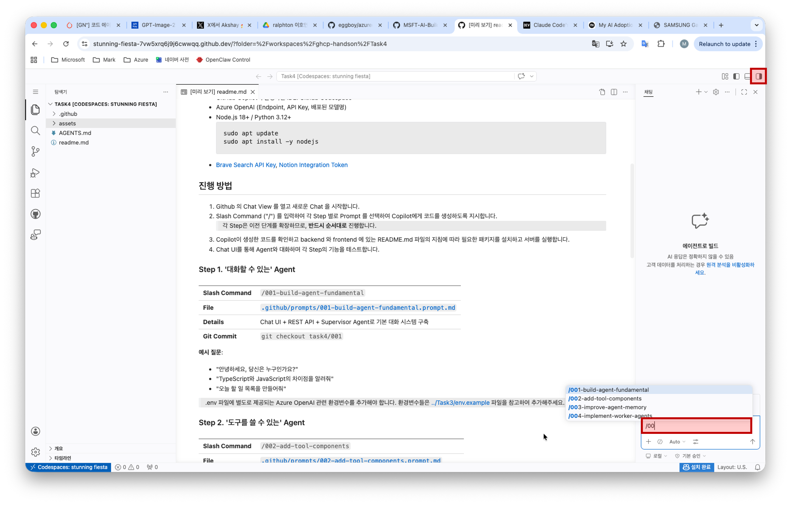
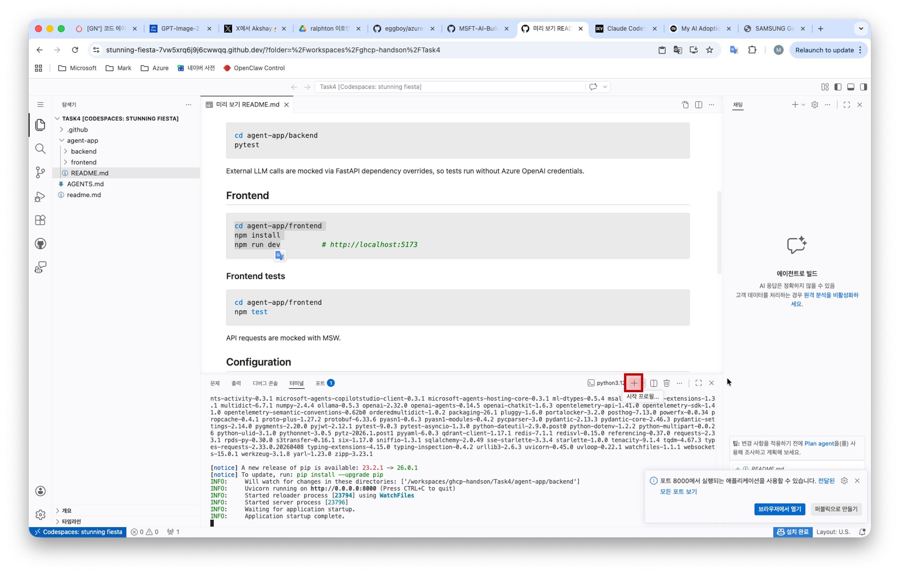
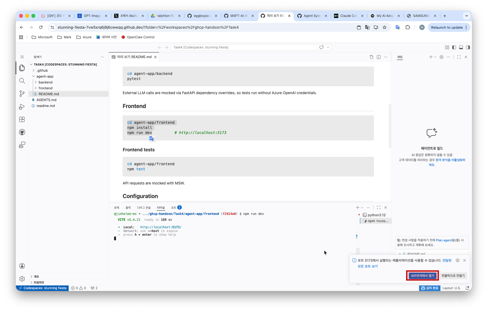
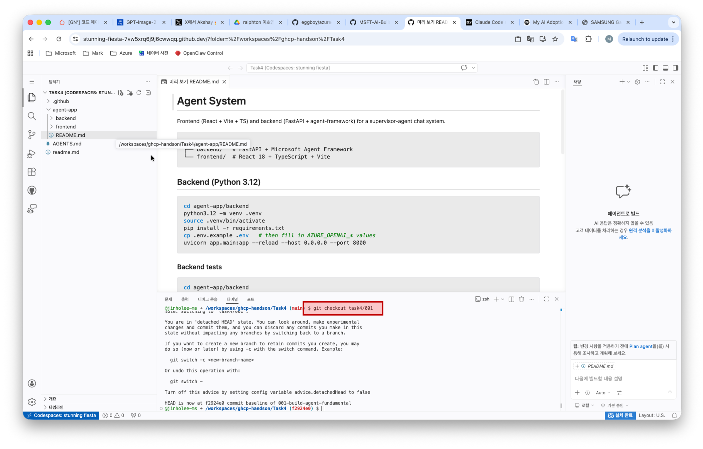

# 🚀 Hands-on Lab 4: Multi-Agent Playground — 협업하는 AI 만들기

> Github Copilot 를 활용하여 Agent 의 기본 기능을 구축하고 협업 가능한 Agent 를 만들어 갑니다. 각 단계는 이전 단계의 기능을 확장하며, 최종적으로 Supervisor Agent가 전문 Worker Agent를 동적으로 생성하여 작업을 위임하는 Multi-Agent 시스템을 구현합니다. Github Copilot 이 실수할 때마다, 그 실수를 다시 못하게 AGENTS.md 도 수정해 나가 보세요.

# Multi-Agent Playground

## Overview
미리 작성된 Instruction Prompt 를 Github Copilot Chat(Agent Mode)에 전달하여 각 Step 별로 코드를 생성하고 실행합니다.
| Step | Focus | Key Concepts | Instruction Prompt |
|---|---|---|---|
| **Step 1** | ['대화할 수 있는' Agent](#step-1-대화할-수-있는-agent) | Agent 기본 구조 구축 | `/001-build-agent-fundamental` |
| **Step 2** | ['도구를 쓸 수 있는' Agent](#step-2-도구를-쓸-수-있는-agent) | Tool Components 추가 | `/002-add-tool-components` |
| **Step 3** | ['기억할 수 있는' Agent](#step-3-기억할-수-있는-agent) | Agent Memory 개선 | `/003-improve-agent-memory` |
| **Step 4** | ['협업할 수 있는' Agent](#step-4-협업할-수-있는-agent) | Worker Agent 구현 (Multi-Agent) | `/004-implement-worker-agents` |

## Prerequisites
- GitHub Copilot이 활성화된 IDE: Github Codespace
- Azure OpenAI (Endpoint, API Key, 배포된 모델명)
- Node.js 18+ / Python 3.12+ 설치
    1. `[명령어 팔레트]`(`Ctrl+Shift+P`) > input field 에 `새 터미널 만들기` 입력 & 선택
        
    2. 아래 명령어 입력
        ```
        sudo apt update
        sudo apt install -y nodejs
        ```
- [Brave Search API Key](https://brave.com/search/api/), [Notion Integration Token](https://www.notion.com/help/create-integrations-with-the-notion-api)


## 진행 방법

1. Codespace 의 작업 영역 변경: [`파일`] > [`폴더 열기`] > `/workspaces/ghcp-handson/Task4/` 입력
    
    
1. Codespace 의 우측상단의 Chat View 를 열고 새로운 Chat 을 시작합니다.
    
2. Slash Command ("/") 를 입력하여 각 Step 별로 Prompt 를 선택하여 Copilot에게 코드를 생성하도록 지시합니다.
    > 각 Step은 이전 단계를 확장하므로, **반드시 순서대로** 진행합니다.
3. Copilot이 생성한 코드를 확인하고 backend 와 frontend 에 있는 README.md 파일의 지침에 따라 필요한 패키지를 설치하고 서버를 실행합니다.
    - 터미널 열기: `[명령어 팔레트]`(`Ctrl+Shift+P`) > input field 에 `새 터미널 만들기` 입력 & 선택
        
    - README.md 의 backend 실행방법에 따라 명령어 실행하고, frontend 실행을 위해 아래와 같이 새로운 터미널 추가
        
    - frontend 실행하면 오른쪽 하단에 `브라우저에서 열기` 선택
        
4. Chat UI를 통해 Agent와 대화하며 각 Step의 기능을 테스트합니다.
5. 만약 Step 을 완성시키지 못했다면, 터미널에 각 Step 에 있는 **Git Commit** 명령어를 실행하여 완성된 코드로 checkout 합니다.
    

### Step 1. '대화할 수 있는' Agent

| | |
|---|---|
| **Slash Command** | `/001-build-agent-fundamental` |
| **File** | [`.github/prompts/001-build-agent-fundamental.prompt.md`](./.github/prompts/001-build-agent-fundamental.prompt.md) |
| **Details** | Chat UI + REST API + Supervisor Agent로 기본 대화 시스템 구축 |
| **Git Commit** | `rm -rf agent-app && git checkout task4/001` |

**예시 질문**:
- "안녕하세요, 당신은 누구인가요?"
- "TypeScript와 JavaScript의 차이점을 알려줘"
- "오늘 할 일 목록을 만들어줘"

> .env 파일에 별도로 제공되는 Azure OpenAI 관련 환경변수를 추가해야 합니다. 환경변수들은 [../Task3/env.example](../Task3/env.example) 파일을 참고하여 추가해주세요.

### Step 2. '도구를 쓸 수 있는' Agent

| | |
|---|---|
| **Slash Command** | `/002-add-tool-components` |
| **File** | [`.github/prompts/002-add-tool-components.prompt.md`](./.github/prompts/002-add-tool-components.prompt.md) |
| **Details** | Native Tool과 MCP Tool을 추가하여 Agent가 외부 도구를 사용할 수 있도록 확장 |
| **Git Commit** | `rm -rf agent-app && git checkout task4/002` |

**예시 질문**:
- "123 * 456 + 789를 계산해줘" (Native Tool)
- "최근 AI 관련 뉴스를 검색해줘" (Brave Search MCP)
- "내 Notion 페이지에서 회의록을 찾아줘" (Notion MCP)
- "현재 디렉토리의 파일 목록을 보여줘" (File System MCP)

> .env 파일에 별도로 제공되는 Notion Integration Token 과 Brave Search API Key 를 추가해야 합니다. key-value 는 [./assets/env-variables.pdf](./assets/env-variables.pdf) 파일을 참고하세요. Password 는 실습시 안내 드립니다.

### Step 3. '기억할 수 있는' Agent

| | |
|---|---|
| **Slash Command** | `/003-improve-agent-memory` |
| **File** | [`.github/prompts/003-improve-agent-memory.prompt.md`](./.github/prompts/003-improve-agent-memory.prompt.md) |
| **Details** | Work Directory에 AGENT.md / MEMORY.md를 두어 Agent가 대화 맥락을 기억하도록 개선 |
| **Git Commit** | `rm -rf agent-app && git checkout task4/003` |

**예시 질문**:
- "내 이름은 XX야. 기억해줘" → (새 대화 시작) → "내 이름이 뭐였지?"
- "나는 Python을 주로 사용해" → (새 대화 시작) → "코드 예제를 보여줘" (Python으로 답변하는지 확인)
- "다음 회의는 금요일 3시로 정했어" → (새 대화 시작) → "회의 일정이 어떻게 됐지?"

### Step 4. '협업할 수 있는' Agent

| | |
|---|---|
| **Slash Command** | `/004-implement-worker-agents` |
| **File** | [`.github/prompts/004-implement-worker-agents.prompt.md`](./.github/prompts/004-implement-worker-agents.prompt.md) |
| **Details** | Supervisor가 작업을 분석하여 전문 Worker Agent를 동적으로 생성하고 위임하는 Multi-Agent 구조 |
| **Git Commit** | `rm -rf agent-app && git checkout task4/004` |

**예시 질문**:
- "2024년 AI 트렌드를 조사해서 요약해줘" (리서치 Worker 생성)
- "이 Python 코드를 리팩토링해줘" (코드 전문가 Worker 생성)
- "최근 뉴스를 검색하고, 동시에 Notion에서 관련 메모를 찾아줘" (병렬 Worker 생성)
- "현재 진행 중인 작업이 뭐야?" (check_workers)
